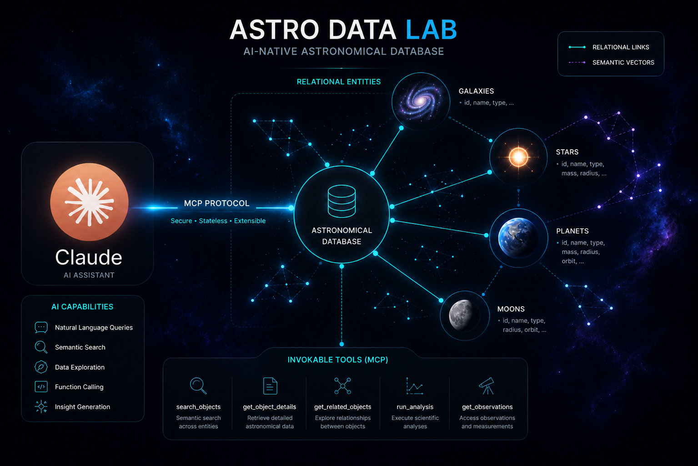

# AstroData Lab



<p align="center">
  
  
  
  
  
</p>

> Sistema híbrido de exploración astronómica que combina un modelo relacional jerárquico con búsqueda vectorial semántica, expuesto como servidor MCP (Model Context Protocol) para Claude Desktop. Consulta, analiza y razona sobre objetos astronómicos almacenados en PostgreSQL mediante un pipeline RAG completo con evaluación de calidad.

---

## Tabla de contenidos

1. [Descripción del proyecto](#descripción-del-proyecto)
2. [Stack tecnológico](#stack-tecnológico)
3. [Arquitectura](#arquitectura)
4. [Modelo de datos](#modelo-de-datos)
5. [Pipeline RAG](#pipeline-rag)
6. [Herramientas MCP disponibles](#herramientas-mcp-disponibles)
7. [Principios de diseño](#principios-de-diseño)
8. [Requisitos previos](#requisitos-previos)
9. [Instalación](#instalación)
10. [Configuración de la base de datos](#configuración-de-la-base-de-datos)
11. [Conexión a Claude Desktop](#conexión-a-claude-desktop)
12. [Ejecución de tests](#ejecución-de-tests)
13. [Referencias académicas](#referencias-académicas)
14. [Equipo](#equipo)

---

## Descripción del proyecto

AstroData Lab resuelve el problema de coexistencia entre datos estructurados y datos semánticos sin un modelo unificado.

Los sistemas relacionales tradicionales permiten filtros exactos (`temperatura < 300K`, `masa > 0.5 M☉`), pero no pueden responder preguntas como *"planetas con condiciones similares a la Tierra"* porque esa noción es semántica y multivariada: no se reduce a umbrales numéricos. El componente vectorial de este sistema cubre exactamente ese espacio.

La innovación central del proyecto es la **consulta híbrida**: una única query PostgreSQL que combina un `WHERE` relacional con un `ORDER BY` por distancia coseno (`<=>`), eliminando la necesidad de fusionar resultados en Python y aprovechando los índices IVFFlat de pgvector directamente desde SQL.

---

## Stack tecnológico

| Tecnología | Versión | Rol en el sistema |
|:---|:---:|:---|
| **PostgreSQL** + **pgvector** | 15+ / 0.7+ | Almacenamiento relacional y búsqueda vectorial por distancia coseno |
| **Python** | 3.11 / 3.12 | Backend, pipeline RAG, servidor MCP |
| **MCP (Model Context Protocol)** | — | Expone las herramientas a Claude Desktop como funciones invocables via stdio |
| **sentence-transformers** `all-MiniLM-L6-v2` | — | Embeddings de texto — 384 dimensiones |
| **CLIP** `openai/clip-vit-base-patch32` | — | Embeddings de imágenes astronómicas — 512 dimensiones |
| **asyncpg** | — | Driver async para PostgreSQL; pool de conexiones |
| **Pydantic v2** | — | Validación y modelado de entidades |
| **RAGAS simplificado** | — | Métricas de evaluación: faithfulness, answer relevancy, context recall |
| **Neon** | — | PostgreSQL serverless en la nube con soporte nativo de pgvector |

> Los modelos de texto e imagen son deliberadamente separados: MiniLM opera en espacio semántico de lenguaje natural (384d) mientras que CLIP opera en espacio multimodal texto-imagen (512d). Compartir un único modelo para ambas modalidades degradaría la calidad de las representaciones vectoriales.

---

## Arquitectura

```
┌─────────────────────────────────┐
│         Claude Desktop          │
│   (interfaz de usuario + LLM)   │
└────────────┬────────────────────┘
             │  MCP protocol (stdio)
             ▼
┌─────────────────────────────────┐
│      server/servidor_mcp.py     │  ← punto de entrada, IoC container,
│                                 │    registro dinámico de tools
└────────────┬────────────────────┘
             │
             ▼
┌─────────────────────────────────┐
│           tools/                │  ← adaptadores MCP (protocolo → caso de uso)
│  consulta_rag.py                │
│  consulta_hibrida.py            │  ← SQL + vector en una query
│  busqueda_semantica.py          │
│  gestion_objetos.py             │
│  evaluacion_ragas.py            │
│  terminal_profesor.py           │  ← demo híbrida guiada (/usarterminal)
│  modo_profesor.py               │  ← presentación académica (/modotexterprofesor)
└────────────┬────────────────────┘
             │
             ▼
┌─────────────────────────────────┐
│          services/              │  ← lógica de negocio y casos de uso
│  rag_service.py                 │
│  servicio_consulta_hibrida.py   │
│  semantic_search_service.py     │
│  objetos_service.py             │
│  chunking_service.py            │  ← fixed · sentence · semantic (Jaccard)
│  evaluation_service.py          │
└────────────┬────────────────────┘
             │
             ▼
┌─────────────────────────────────┐
│          database/              │  ← repositorios (patrón Repository)
│  repositorio_documentos.py      │  ← consulta_hibrida_sql() + query builder
│  repositorio_consultas.py       │
│  repositorio_objetos.py         │
│  repositorio_observaciones.py   │
│  embeddings/                    │
│    codificador_texto.py         │  ← MiniLM async (run_in_executor)
│    codificador_imagen.py        │  ← CLIP async (run_in_executor)
└────────────┬────────────────────┘
             │
             ▼
┌─────────────────────────────────┐
│     PostgreSQL + pgvector       │
│     (Neon serverless cloud)     │
└─────────────────────────────────┘
```

**Módulos complementarios:**

```
models/              ← entidades Pydantic v2
evaluation/
  └── consultas_prueba.py   ← 10 consultas fijas + GROUND_TRUTH + context recall
```

---

## Modelo de datos

### Jerarquía IS-A de objetos astronómicos

La entidad central es `Objeto_Astronomico`, que actúa como superentidad de la jerarquía de herencia relacional:

```
Objeto_Astronomico  (id_objeto PK, nombre, descripcion_cientifica)
    ├── Galaxia          (id_objeto PK + FK → Objeto_Astronomico  ON DELETE CASCADE)
    ├── Sistema_Estelar  (id_objeto PK + FK → Objeto_Astronomico  ON DELETE CASCADE)
    ├── Estrella         (id_objeto PK + FK → Objeto_Astronomico  ON DELETE CASCADE)
    ├── Planeta          (id_objeto PK + FK → Objeto_Astronomico  ON DELETE CASCADE)
    └── Luna             (id_objeto PK + FK → Objeto_Astronomico  ON DELETE CASCADE)
```

La PK compartida garantiza que no puede existir una fila en `Galaxia` sin su correspondiente en `Objeto_Astronomico`. El `ON DELETE CASCADE` asegura que eliminar la superentidad elimina automáticamente el subtipo, previniendo registros huérfanos.

> **Nota de diseño:** puede existir un `Objeto_Astronomico` sin subtipo (registro base sin especialización). Esta limitación conocida del IS-A en SQL puro se gestiona mediante una **transacción compensatoria** en `objetos_service.py`: si la creación del embedding falla después de insertar el objeto base, el objeto base se elimina automáticamente.

### Opcionalidad intencional en documentos e imágenes

| Relación | Nulabilidad | Justificación |
|:---|:---:|:---|
| `Documento.id_objeto` | NULL permitido | El sistema admite documentos de astronomía general no ligados a un cuerpo celeste específico (artículos de revisión, manuales de telescopios) |
| `Imagen.id_doc` | NULL permitido | El sistema admite imágenes de referencia general (mapas estelares, diagramas) no pertenecientes a un documento |

### Integridad de Resultado

La tabla `Resultado` tiene dos FKs opcionales (`id_doc`, `id_imagen`). La restricción de que **al menos una debe ser no nula** se implementa como validación de capa de repositorio antes de cualquier operación en base de datos:

```python
# repositorio_consultas.py
if datos.id_doc is None and datos.id_imagen is None:
    raise ValueError("El resultado debe estar asociado a un documento o a una imagen.")
```

### Campos vectorizables

Solo se vectorizan contenidos textuales reales. Identificadores y vectores ya almacenados no son insumos de vectorización:

| Campo | Tabla | Modelo | Dimensiones |
|:---|:---|:---:|:---:|
| `descripcion_cientifica` | `Objeto_Astronomico` | MiniLM | 384 |
| `contenido_chunk` | `Embedding_Texto` | MiniLM | 384 |
| `descripcion` | `Imagen` | CLIP texto | 512 |
| `etiquetas` | `Imagen` | CLIP texto | 512 |
| píxeles de imagen | `Imagen` | CLIP imagen | 512 |
| `texto_pregunta` | `Consulta` | MiniLM | 384 |

> `chunk_id` es un identificador secuencial; `vector` es el resultado de la vectorización. Ninguno de los dos es un campo vectorizable.

---

## Pipeline RAG

### Consulta híbrida SQL + vector search

La consulta híbrida construye una **única query SQL** que combina filtros relacionales con búsqueda vectorial. No ejecuta dos queries separadas en Python ni fusiona resultados con RRF:

```sql
SELECT et.id_doc, d.titulo, et.chunk_id,
       et.contenido_chunk              AS contenido,
       et.estrategia_chunking,
       1 - (et.vector <=> $1::vector)  AS similitud
FROM Embedding_Texto et
JOIN Documento d ON d.id_doc = et.id_doc
WHERE d.idioma = $3          -- filtro relacional (dinámico, whitelist)
ORDER BY et.vector <=> $1::vector
LIMIT $2
```

Los filtros se construyen dinámicamente mediante un **query builder** con whitelist explícita (`idioma`, `fuente`, `id_objeto`) que previene inyección SQL. El `WHERE` reduce el espacio de búsqueda relacionalmente antes de que pgvector calcule las distancias coseno, aprovechando los índices IVFFlat.

### Estrategias de chunking

`ChunkingService` implementa tres estrategias reales, todas accesibles via el método `dividir()`:

| Estrategia | Descripción | Caso de uso |
|:---|:---|:---|
| `fixed` | Ventanas de 160 palabras con solapamiento de 24 | Textos uniformes sin estructura de oraciones clara |
| `sentence` | Agrupa oraciones respetando límite de 120 palabras con solapamiento de 1 oración | Descripciones científicas con oraciones semánticamente completas |
| `semantic` | Detecta cambios temáticos por **similitud Jaccard** entre oraciones contiguas; corta cuando la cohesión cae bajo el umbral configurado | Documentos con secciones temáticas diferenciadas |

La estrategia `semantic` es especialmente adecuada para el corpus astronómico: una descripción de planeta típicamente alterna entre composición química, temperatura, historia orbital y habitabilidad. El chunker semántico los separa temáticamente, produciendo chunks más cohesivos que las estrategias de ventana fija.

### Evaluación RAG — ground truth y context recall

El módulo `evaluation/consultas_prueba.py` define el conjunto fijo de evaluación reproducible:

```python
CONSULTAS_PRUEBA = [
    "planetas con condiciones similares a la Tierra",
    "objetos con posible habitabilidad",
    "planetas con atmósfera densa",
    "lunas con posible océano interno",
    "estrellas similares al Sol",
    "planetas rocosos cercanos a su estrella",
    "cuerpos celestes con baja temperatura superficial",
    "objetos observados por telescopios espaciales",
    "planetas con evidencia de agua líquida",
    "sistemas estelares con múltiples planetas",
]
```

El `GROUND_TRUTH` asocia cada consulta con los `id_doc` relevantes esperados. La función `calcular_context_recall` mide:

```
Context Recall = |ids_esperados ∩ ids_recuperados| / |ids_esperados|
```

---

## Herramientas MCP disponibles

| Tool | Slash command | Descripción |
|:---|:---:|:---|
| `rag_query` | — | Consulta semántica libre con pipeline RAG completo |
| `consulta_hibrida` | — | SQL + vector en una sola query, con filtros relacionales |
| `usarterminal` | `/usarterminal` | Terminal de consultas híbridas guiada, muestra el pipeline paso a paso |
| `modo_profesor` | `/modotexterprofesor` | Presentación académica con estado en vivo del sistema |
| `encontrar_planetas_similares` | — | Búsqueda semántica de planetas por descripción |
| `buscar_imagenes_por_descripcion` | — | Recuperación de imágenes por texto con CLIP |
| `buscar_imagenes_similares` | — | Similitud visual usando embeddings CLIP 512d |
| `evaluar_respuesta_rag` | — | Métricas RAGAS: faithfulness, answer relevancy, context recall |
| `crear_objeto_astronomico` | — | CRUD con transacción compensatoria automática |
| `listar_planetas_habitables` | — | Consulta relacional con filtro de puntaje mínimo |

---

## Principios de diseño

### SOLID

| Principio | Módulo | Implementación |
|:---|:---|:---|
| **SRP** | `tools/consulta_rag.py`, `tools/gestion_objetos.py` | Cada tool orquesta solo su flujo; no implementa persistencia ni embeddings |
| **OCP** | `database/repositorio_documentos.py` | Extensible con nuevos métodos sin modificar los existentes |
| **LSP** | `codificador_texto.py`, `codificador_imagen.py` | Ambas implementaciones son intercambiables donde se use `CodificadorBase` |
| **DIP** | `interfaz_codificador.py` + inyección en `tools/` | Las herramientas dependen de la abstracción, nunca de la implementación concreta |

### Decisiones técnicas

**Embeddings async con `run_in_executor`** — `sentence-transformers` y CLIP ejecutan inferencia síncrona sobre PyTorch. Llamarlos directamente en un método `async` bloquea el event loop del servidor MCP. Ambos codificadores delegan la inferencia a un `ThreadPoolExecutor` via `asyncio.run_in_executor`.

**Transacción compensatoria** — `crear_objeto_astronomico` crea el objeto base y su embedding en pasos secuenciales. Si el embedding falla después de crear el objeto, la función elimina el objeto base automáticamente para evitar registros huérfanos. Es una alternativa pragmática a compartir una conexión de transacción entre repositorios independientes.

**Separación de modelos por modalidad** — `CodificadorTexto` (MiniLM, 384d) y `CodificadorImagen` (CLIP, 512d) implementan la misma interfaz `CodificadorBase` pero operan en espacios vectoriales distintos e incompatibles. El servidor MCP los instancia por separado e inyecta cada uno donde corresponde.

**Índices IVFFlat** — Los índices sobre `Embedding_Texto`, `Embedding_Imagen` y `Embedding_Consulta` son dinámicos: no requieren recreación al insertar datos nuevos. Se recomienda ejecutar `REINDEX` cuando el volumen de datos supere 2× el tamaño en el momento de creación del índice, para mantener la calidad de los clusters.

---

## Requisitos previos

- Python **3.11** o **3.12** (recomendado para compatibilidad con `torch` y `sentence-transformers`)
- PostgreSQL **15+** con la extensión `pgvector` instalada y activa — o una instancia **Neon** (ver sección de credenciales al final)
- **Claude Desktop** instalado y configurado

---

## Instalación

```bash
# 1. Clonar el repositorio
git clone https://github.com/TheLaico/AstroData-Lab.git
cd AstroData-Lab

# 2. Crear entorno virtual
python -m venv .venv

# Activar en macOS / Linux
source .venv/bin/activate

# Activar en Windows (PowerShell)
.venv\Scripts\Activate.ps1

# 3. Instalar dependencias
pip install -r requerimientos.txt

# 4. Configurar variables de entorno
cp config/.env.example config/.env
```

Editar `config/.env` con las credenciales de la base de datos:

```env
DB_HOST=your_host
DB_PORT=5432
DB_NAME=astrodata
DB_USER=your_user
DB_PASSWORD=your_password
DB_SSL=require      # "require" para Neon · "disable" para PostgreSQL local
```

---

## Configuración de la base de datos

Ejecutar los scripts en orden estricto (`pgvector` debe estar activo antes de crear columnas de tipo `vector`):

```bash
psql -d astrodata -f sql/001_schema_relacional.sql
psql -d astrodata -f sql/002_pgvector.sql
psql -d astrodata -f sql/003_seed_data.sql
```

Parámetros de índices IVFFlat ajustados por volumen esperado:

| Tabla | `lists` | Justificación |
|:---|:---:|:---|
| `Embedding_Texto` | 100 | Mayor volumen de chunks de documentos |
| `Embedding_Imagen` | 50 | Menor volumen de imágenes |
| `Embedding_Consulta` | 50 | Volumen proporcional a consultas de usuario |

---

## Conexión a Claude Desktop

1. Abrir el archivo de configuración de Claude Desktop:
   - **Windows:** `%APPDATA%\Claude\claude_desktop_config.json`
   - **macOS:** `~/Library/Application Support/Claude/claude_desktop_config.json`

2. Agregar la entrada del servidor MCP:

```json
{
  "mcpServers": {
    "astrodata-mcp": {
      "command": "C:/ruta/al/proyecto/AstroData-Lab/.venv/Scripts/python.exe",
      "args": ["C:/ruta/al/proyecto/AstroData-Lab/server/servidor_mcp.py"],
      "env": {
        "PYTHONPATH": "C:/ruta/al/proyecto/AstroData-Lab"
      }
    }
  }
}
```

3. Guardar el archivo y reiniciar Claude Desktop completamente.

4. Verificar la conexión escribiendo en el chat:

```
astro data lab
```

---

## Ejecución de tests

```bash
# Suite completa
pytest tests/ -v

# Con reporte de cobertura
pytest tests/ -v --cov=tools --cov=database --cov-report=term-missing

# Módulo específico
pytest tests/prueba_rag.py -v
```

> Los tests usan mocks completos de repositorios y codificadores. **No requieren base de datos activa.**

---

## Referencias académicas

- Lewis, P. et al. (2020). *Retrieval-Augmented Generation for Knowledge-Intensive NLP Tasks*. NeurIPS 2020.
- Gao, Y. et al. (2023). *Retrieval-Augmented Generation for Large Language Models: A Survey*. arXiv:2312.10997.
- Reimers, N. & Gurevych, I. (2019). *Sentence-BERT: Sentence Embeddings using Siamese BERT-Networks*. EMNLP 2019.
- Es, S. et al. (2023). *RAGAS: Automated Evaluation of Retrieval Augmented Generation*. arXiv:2309.15217.
- Johnson, J. et al. (2021). *Billion-scale similarity search with GPUs*. IEEE Transactions on Big Data.

---


## Credenciales de la base de datos en Neon

Este proyecto utiliza **Neon** como proveedor de PostgreSQL serverless con pgvector habilitado.

Si necesitas acceso a la instancia de base de datos para reproducir los resultados o explorar el corpus astronómico, ponte en contacto con el equipo:

📧 **vargasalvareznicolas359@gmail.com**

---

<p align="center">
  <sub>AstroData Lab — Explorando el universo con SQL y vectores</sub>
</p>
